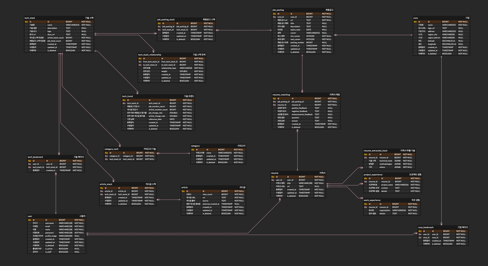
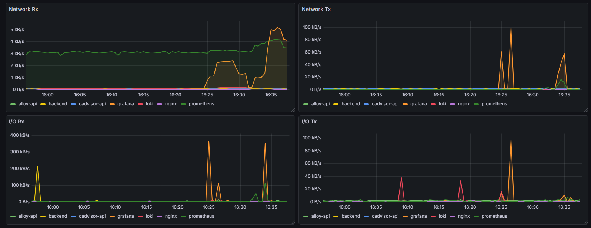
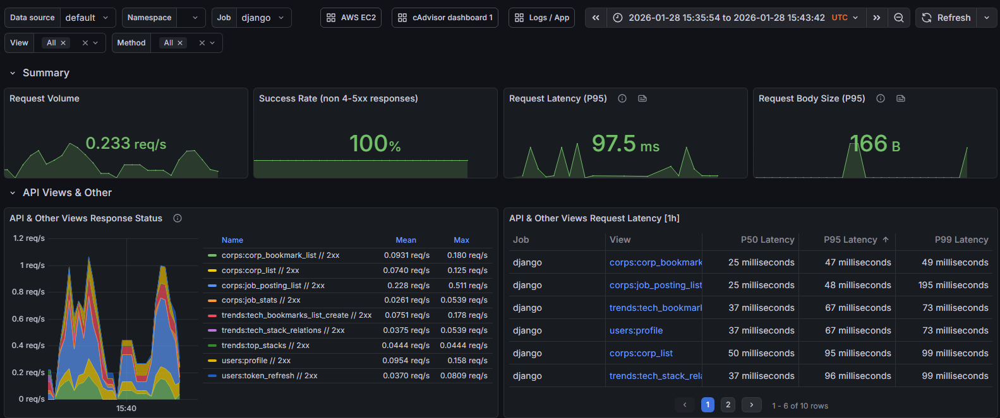

<div align="center">

#  **DevRoad**

### **채용 공고 및 이력서 기반 트렌드 분석 서비스** 
<br><br>


<br><br>
💡 편하게 한눈에 IT 트렌드를 확인하세요
<br><br>

</div>


<br><br>

# 📖 Table of contents

* [Introduction](#-introduction)
* [Product](#product)
* [API](#-api)
* [System Architecture](#-system-architecture)
* [ERD](#-erd)
* [Tech Stack](#-tech-stack)
* [Monitoring](#-monitoring)
* [How to start](#-how-to-start)
* [Directory Structure](#-directory-structure)
* [Team Members](#-team-members)

<br><br>

# 📣 Introduction

## 🖥️ DevRoad

> URL : [devroad.cloud](https://devroad.cloud)

## 🔎 DevRoad Medium 

> URL : [DevRoad Medium](https://medium.com/@heeyoung054/devroad-%EC%B1%84%EC%9A%A9-%EB%8D%B0%EC%9D%B4%ED%84%B0%EC%99%80-ai%EB%A1%9C-%EA%B0%9C%EB%B0%9C%EC%9E%90-%EC%BB%A4%EB%A6%AC%EC%96%B4-%EA%B2%B0%EC%A0%95%EC%9D%84-%EB%8F%95%EB%8A%94-%EC%84%9C%EB%B9%84%EC%8A%A4-2bdf43fb5003?postPublishedType=repub)

<br><br>

<hr>
### 주요 기능

### 📈 **기술 트렌드 확인**
* 채용 공고 및 게시글에서 기술 스택을 추출해 시계열 그래프로 시각화

### 🧾 **채용 공고 확인**
* 현재 진행중인 채용 공고를 확인할 수 있고 채용 공고 사이트로 이동

### 🧭 **채용 지도**
* 지도와 함께 채용 공고를 올린 회사의 위치를 확인

### 📄 **면접 대비**
* 이력서를 업로드해 Ollama와 Gemma3를 활용한 이력서 분석 및 Gemini를 통한 면접 질문 생성

### 😀 **마이 페이지**
* 자신의 이력서를 관리할 수 있으며 즐겨찾기를 확인

<br><br>


# Product

## Onboarding

> DevRoad의 서비스 흐름을 보여줍니다.


## Dashboard

> 언급량이 높은 기술과 추천 채용 공고 및 즐겨찾기된 기업의 채용 공고를 확인할 수 있습니다.


## Job-Posting Map

> 채용 공고를 지도에서 위치와 함께 확인할 수 있습니다.


## Prepare Interview

> 이력서를 업로드하고, 채용 공고별 분석 내용을 확인할 수 있습니다.


## Login & Logout

> Google OAuth와 JWT를 활용해 소셜 로그인을 수행합니다.


## MyPage

> 업로드한 이력서와 기업 및 기술에 대한 즐겨찾기를 조회할 수 있습니다.


<br><br>

# 📗 API


<a name="-system-architecture"></a>

<br><br>

# 🛠️ System Architecture


<br><br>

# 🔑 ERD





<br><br>


# 💻 Tech Stack
<div>
  <table>
    <tr>
      <th>Field</th>
      <th>Technology of Use</th>
    </tr>
    <tr>
      <td><b>Frontend</b></td>
      <td>
        
        
        
        
      </td>
    </tr>
    <tr>
      <td><b>Backend</b></td>
      <td>
        
        
        
        
      </td>
    </tr>
    <tr>
      <td><b>Database</b></td>
      <td>
        
        
        
      </td>
    </tr>
    <tr>
      <td><b>AI</b></td>
      <td>
        
        
        
      </td>
      </td>
    </tr>
    <tr>
      <td><b>DevOps</b></td>
      <td>
        
        
        
        
        
      </td>
    </tr>
    <tr>
      <td><b>Monitoring</b></td>
      <td>
        
        
        
      </td>
    </tr>
    <tr>
      <td><b>Logging</b></td>
      <td>
        
        
      </td>
    </tr>
    <tr>
      <td><b>ETC</b></td>
      <td>
        
        
        
        
        
        
      </td>
    </tr>
  </table>
</div>
</br>


<br><br>


# 📊 Monitoring


<table>
  <tr>
    <td colspan="2" align="center"><b>cAdvisor/Loki</b></td>
  </tr>
  <tr>
    <td></td>
    <td></td>
  </tr> 
  <tr>
    <td colspan="2" align="center"><b>django</b></td>
  </tr>
  <tr>
    <td></td>
    <td></td>
  </tr>   
  <tr>
    <td colspan="2" align="center"><b>CloudWatch</b></td>
  </tr>
  <tr>
    <td></td>
    <td></td>
  </tr>
  <tr>
    <td colspan="2" align="center"><b></b></td>
  </tr>
</table>


<br><br>


# 🚀 How to start

## 1. 프로젝트 클론
```bash
git clone https://github.com/2025-Winter-Bootcamp-TeamA/backend.git
git clone https://github.com/2025-Winter-Bootcamp-TeamA/frontend.git
```

## 2. Backend 설정 및 실행

```bash

```

## 3. Frontend 설정 및 실행

```bash
npm install
npm run dev
```

### 4. .env

```bash
# -------------------------------------------
# Django 설정
# -------------------------------------------
SECRET_KEY=
DEBUG=
ALLOWED_HOSTS=

# -------------------------------------------
# 데이터베이스 설정 (AWS RDS PostgreSQL)
# -------------------------------------------
DB_NAME=
DB_USER=
DB_PASSWORD=
DB_HOST=
DB_PORT=

# -------------------------------------------
# Redis 설정 (AWS ElastiCache)
# -------------------------------------------
REDIS_URL=

# -------------------------------------------
# RabbitMQ 설정 (EC2 인스턴스)
# -------------------------------------------
RABBITMQ_USER=
RABBITMQ_PASSWORD=
RABBITMQ_HOST=
RABBITMQ_PORT=

# -------------------------------------------
# Celery 설정 (비동기 작업)
# -------------------------------------------
CELERY_RESULT_BACKEND=

# -------------------------------------------
# CORS 설정
# -------------------------------------------
CORS_ALLOWED_ORIGINS=
CSRF_TRUSTED_ORIGINS=

# -------------------------------------------
# AI API 키
# -------------------------------------------
GOOGLE_GEMINI_API_KEY=

# -------------------------------------------
# AWS 설정 (프로덕션용)
# -------------------------------------------
AWS_ACCESS_KEY_ID=
AWS_SECRET_ACCESS_KEY=
AWS_STORAGE_BUCKET_NAME=

# -------------------------------------------
# Frontend 설정 (Next.js)
# -------------------------------------------
NEXT_PUBLIC_API_URL=
NEXT_PUBLIC_APP_URL=
FRONTEND_URL=

# -------------------------------------------
# 구글 OAuth (프로덕션)
# -------------------------------------------
GOOGLE_OAUTH2_CLIENT_ID=
GOOGLE_OAUTH2_CLIENT_SECRET=
GOOGLE_REDIRECT_URI=

OLLAMA_URL=

# 카카오 지도 API
KAKAO_REST_API_KEY=

API_SERVER_IP=
WORKER_SERVER_IP=
HOST_WORKER=
HOST_API=

```


<br><br>


# 📁 Directory Structure

<details>
<summary>DevRoad-Backend</summary>
         
```
🗂️ Backend
┣ 📃 .dockerignore
┣ 📃 .env.local
┣ 📃 .env.production
┣ 📃 .gitignore
┣ 📃 analyze_tech_relationships.py
┣ 📃 DOCKER_GUIDE.md
┣ 📃 docker-compose.api.yml
┣ 📃 docker-compose.dev.yml
┣ 📃 docker-compose.worker.yml
┣ 📃 Dockerfile
┣ 📃 manage.py
┣ 📃 names.txt
┣ 📃 README.md
┣ 📃 requirements.txt
┣ 📃 restart_docker.sh
┣ 📃 tech_stacks_merged_final.csv
┣ 📃 tech_stacks_relationships.json
┣ 🗂️ .git/... (ignored for detailed listing)
┣ 🗂️ .github
┃ ┣ 🗂️ ISSUE_TEMPLATE
┃ ┃ ┣ 📃 chore.md
┃ ┃ ┣ 📃 design.md
┃ ┃ ┣ 📃 feat.md
┃ ┃ ┣ 📃 fix.md
┃ ┃ ┗ 📃 refactoring.md
┃ ┣ 🗂️ workflows
┃ ┃ ┗ 📃 deploy.yml
┃ ┗ 📃 pull_request_template.md
┣ 🗂️ apps
┃ ┣ 🗂️ analytics
┃ ┃ ┣ 🗂️ management
┃ ┃ ┃ ┣ 🗂️ commands
┃ ┃ ┃ ┃ ┣ 📃 analyze_stackoverflow.py
┃ ┃ ┃ ┃ ┗ 📃 __init__.py
┃ ┃ ┃ ┗ 📃 __init__.py
┃ ┃ ┣ 🗂️ migrations
┃ ┃ ┃ ┗ 📃 __init__.py
┃ ┃ ┣ 📃 __init__.py
┃ ┃ ┣ 📃 admin.py
┃ ┃ ┣ 📃 apps.py
┃ ┃ ┣ 📃 models.py
┃ ┃ ┣ 📃 tests.py
┃ ┃ ┗ 📃 views.py
┃ ┣ 🗂️ interviews
┃ ┃ ┣ 🗂️ migrations
┃ ┃ ┃ ┗ 📃 __init__.py
┃ ┃ ┣ 📃 __init__.py
┃ ┃ ┣ 📃 admin.py
┃ ┃ ┣ 📃 apps.py
┃ ┃ ┣ 📃 models.py
┃ ┃ ┣ 📃 serializers.py
┃ ┃ ┣ 📃 urls.py
┃ ┃ ┗ 📃 views.py
┃ ┣ 🗂️ jobs
┃ ┃ ┣ 🗂️ management
┃ ┃ ┃ ┣ 🗂️ commands
┃ ┃ ┃ ┃ ┣ 📃 run_crawling.py
┃ ┃ ┃ ┃ ┗ 📃 __init__.py
┃ ┃ ┃ ┗ 📃 __init__.py
┃ ┃ ┣ 🗂️ migrations
┃ ┃ ┃ ┣ 📃 0001_initial.py
┃ ┃ ┃ ┣ 📃 0002_initial.py
┃ ┃ ┃ ┣ 📃 0003_remove_jobposting_stack_count_and_more.py
┃ ┃ ┃ ┣ 📃 0004_remove_jobpostingstack_job_stack_count.py
┃ ┃ ┃ ┣ 📃 0005_alter_jobpostingstack_unique_together.py
┃ ┃ ┃ ┣ 📃 0006_corp_region_city_corp_region_district_and_more.py
┃ ┃ ┃ ┗ 📃 __init__.py
┃ ┃ ┣ 📃 __init__.py
┃ ┃ ┣ 📃 admin.py
┃ ┃ ┣ 📃 apps.py
┃ ┃ ┣ 📃 filters.py
┃ ┃ ┣ 📃 models.py
┃ ┃ ┣ 📃 serializers.py
┃ ┃ ┣ 📃 signals.py
┃ ┃ ┣ 📃 tasks.py
┃ ┃ ┣ 📃 urls.py
┃ ┃ ┗ 📃 views.py
┃ ┣ 🗂️ resumes
┃ ┃ ┣ 🗂️ migrations
┃ ┃ ┃ ┣ 📃 0001_initial.py
┃ ┃ ┃ ┣ 📃 0002_initial.py
┃ ┃ ┃ ┣ 📃 0003_remove_resumematching_updated_at.py
┃ ┃ ┃ ┣ 📃 0004_projectexperience_workexperience.py
┃ ┃ ┃ ┣ 📃 0005_resumeextractedstack.py
┃ ┃ ┃ ┣ 📃 0006_alter_resumematching_unique_together_and_more.py
┃ ┃ ┃ ┣ 📃 0007_remove_resumematching_feedback_and_more.py
┃ ┃ ┃ ┣ 📃 0008_resumematching_enhancements_feedback.py
┃ ┃ ┃ ┗ 📃 __init__.py
┃ ┃ ┣ 📃 __init__.py
┃ ┃ ┣ 📃 admin.py
┃ ┃ ┣ 📃 apps.py
┃ ┃ ┣ 📃 models.py
┃ ┃ ┣ 📃 serializers.py
┃ ┃ ┣ 📃 tasks.py
┃ ┃ ┣ 📃 urls.py
┃ ┃ ┣ 📃 utils.py
┃ ┃ ┗ 📃 views.py
┃ ┣ 🗂️ trends
  ┃ ┃ ┣ 🗂️ management
  ┃ ┃ ┃ ┣ 🗂️ commands
  ┃ ┃ ┃ ┃ ┣ 📃 categorize_stacks.py
  ┃ ┃ ┃ ┃ ┣ 📃 export_categorized_tech_stacks.py
  ┃ ┃ ┃ ┃ ┣ 📃 generate_article_trends.py
  ┃ ┃ ┃ ┃ ┣ 📃 generate_fake_article_trends.py
  ┃ ┃ ┃ ┃ ┣ 📃 generate_fake_job_trends.py
  ┃ ┃ ┃ ┃ ┣ 📃 import_categories.py
  ┃ ┃ ┃ ┃ ┣ 📃 import_tech_relationships.py
  ┃ ┃ ┃ ┃ ┣ 📃 import_tech_stacks.py
  ┃ ┃ ┃ ┃ ┣ 📃 recalculate_job_trends.py
  ┃ ┃ ┃ ┃ ┣ 📃 seed_database.py
  ┃ ┃ ┃ ┃ ┣ 📃 sync_stack_counts.py
  ┃ ┃ ┃ ┃ ┣ 📃 xml_divider.py
  ┃ ┃ ┃ ┃ ┗ 📃 __init__.py
  ┃ ┃ ┃ ┗ 📃 __init__.py
  ┃ ┃ ┣ 🗂️ migrations
  ┃ ┃ ┃ ┣ 📃 0001_initial.py
  ┃ ┃ ┃ ┣ 📃 0002_initial.py
  ┃ ┃ ┃ ┣ 📃 0003_remove_techbookmark_is_deleted.py
  ┃ ┃ ┃ ┣ 📃    0004_alter_article_url_alter_articlestack_unique_together.p
  ┃ ┃ ┃ ┣ 📃 0004_techstack_description.py
  ┃ ┃ ┃ ┣ 📃 0005_article_view_count.py
  ┃ ┃ ┃ ┣ 📃 0005_techstackrelationship.py
  ┃ ┃ ┃ ┣ 📃 0006_merge_20260122_2106.py
  ┃ ┃ ┃ ┣ 📃 0006_techstack_article_stack_count_and_more.py
  ┃ ┃ ┃ ┣ 📃 0007_merge_20260121_2111.py
  ┃ ┃ ┃ ┣ 📃 0007_remove_article_stack_count_remove_articlestack_count_a_more.py
  ┃ ┃ ┃ ┣ 📃 0008_merge_20260122_0330.py
  ┃ ┃ ┃ ┣ 📃 0009_merge_20260122_2357.py
  ┃ ┃ ┃ ┣ 📃 0010_alter_techtrend_options_remove_techtrend_change_rate_a_more.py
  ┃ ┃ ┃ ┣ 📃 0011_add_article_mention_fields.py
  ┃ ┃ ┃ ┣ 📃 0012_add_article_external_created_at.py
  ┃ ┃ ┃ ┗ 📃 __init__.py
  ┃ ┃ ┣ 📃 __init__.py
  ┃ ┃ ┣ 📃 admin.py
  ┃ ┃ ┣ 📃 apps.py
  ┃ ┃ ┣ 📃 models.py
  ┃ ┃ ┣ 📃 serializers.py
  ┃ ┃ ┣ 📃 urls.py
  ┃ ┃ ┗ 📃 views.py
  ┃ ┣ 🗂️ users
  ┃ ┃ ┣ 🗂️ migrations
  ┃ ┃ ┃ ┣ 📃 0001_initial.py
  ┃ ┃ ┃ ┣ 📃 0002_user_username_alter_user_id_alter_user_is_active_and_me.py
  ┃ ┃ ┃ ┣ 📃 0003_user_profile_image.py
  ┃ ┃ ┃ ┗ 📃 __init__.py
  ┃ ┃ ┣ 📃 __init__.py
  ┃ ┃ ┣ 📃 admin.py
  ┃ ┃ ┣ 📃 apps.py
  ┃ ┃ ┣ 📃 models.py
  ┃ ┃ ┣ 📃 serializers.py
  ┃ ┃ ┣ 📃 urls.py
  ┃ ┃ ┗ 📃 views.py
  ┃ ┗ 📃 __init__.py
  ┣ 🗂️ config
  ┃ ┣ 🗂️ settings
  ┃ ┃ ┣ 📃 __init__.py
  ┃ ┃ ┣ 📃 base.py
  ┃ ┃ ┣ 📃 local.py
  ┃ ┃ ┗ 📃 production.py
  ┃ ┣ 📃 __init__.py
  ┃ ┣ 📃 asgi.py
  ┃ ┣ 📃 celery.py
  ┃ ┣ 📃 urls.py
  ┃ ┗ 📃 wsgi.py
  ┣ 🗂️ grafana
  ┃ ┗ 🗂️ provisioning
  ┃     ┗ 🗂️ datasources
  ┃         ┣ 📃 loki.yml
  ┃         ┗ 📃 prometheus.yml
  ┣ 🗂️ media/ (empty)
  ┣ 🗂️ monitoring
  ┃ ┣ 📃 config.alloy
  ┃ ┣ 📃 loki-config.yml
  ┃ ┣ 📃 prometheus.yml
  ┃ ┗ 📃 worker-config.alloy
  ┣ 🗂️ nginx
  ┃ ┗ 📃 nginx.conf
  ┣ 🗂️ scripts
  ┃ ┣ 📃 __init__.py
  ┃ ┣ 📃 create_admin.py
  ┃ ┣ 📃 example_usage.py
  ┃ ┣ 📃 kor_context_patch.py
  ┃ ┣ 📃 module_resume_extractor.py
  ┃ ┣ 📃 names.txt
  ┃ ┣ 📃 pdf_text_extractor.py
  ┃ ┣ 📃 resume_extractor_with_pdf.py
  ┃ ┣ 📃 resume_extractor2.py
  ┃ ┗ 📃 tech_stack_extractor.py
  ┗ 🗂️ staticfiles/ (empty)

```

</details>

<details>
<summary>DevRoad-Frontend</summary>
         
```
🗂️ Frontend
┣ 📃 .env.local
┣ 📃 .env.production
┣ 📃 .eslintrc.json
┣ 📃 .gitignore
┣ 📃 .prettierrc
┣ 📃 eslint.config.mjs
┣ 📃 next-env.d.ts
┣ 📃 next.config.js
┣ 📃 package-lock.json
┣ 📃 package.json
┣ 📃 postcss.config.js
┣ 📃 README.md
┣ 📃 tailwind.config.ts
┣ 📃 tsconfig.json
┣ 📃 vercel.json
┣ 🗂️ .git/... (ignored for detailed listing)
┣ 🗂️ .github
┃ ┣ 🗂️ ISSUE_TEMPLATE
┃ ┃ ┣ 📃 chore.md
┃ ┃ ┣ 📃 design.md
┃ ┃ ┣ 📃 feat.md
┃ ┃ ┣ 📃 fix.md
┃ ┃ ┗ 📃 refactoring.md
┃ ┗ 📃 pull_request_template.md
┣ 🗂️ .next
┃ ┗ 🗂️ dev
┃     ┣ 📃 build-manifest.json
┃     ┣ 📃 fallback-build-manifest.json
┃     ┣ 📃 lock
┃     ┣ 📃 package.json
┃     ┣ 📃 prerender-manifest.json
┃     ┣ 📃 routes-manifest.json
┃     ┗ 📃 trace
┣ 🗂️ node_modules/... (ignored for detailed listing)
┣ 🗂️ public
┃ ┣ 📃 logo.png
┃ ┗ 📃 onboarding3.png
┗ 🗂️ src
    ┣ 🗂️ app
    ┃ ┣ 🗂️ ai-interview
    ┃ ┃ ┗ 📃 page.tsx
    ┃ ┣ 🗂️ auth
    ┃ ┃ ┗ 🗂️ callback
    ┃ ┃     ┗ 📃 page.tsx
    ┃ ┣ 🗂️ map
    ┃ ┃ ┗ 📃 page.tsx
    ┃ ┣ 🗂️ mypage
    ┃ ┃ ┗ 📃 page.tsx
    ┃ ┣ 📃 globals.css
    ┃ ┣ 📃 layout.tsx
    ┃ ┣ 📃 page.tsx
    ┃ ┗ 📃 providers.tsx
    ┣ 🗂️ components
    ┃ ┣ 🗂️ ai-interview
    ┃ ┃ ┣ 📃 Countup.tsx
    ┃ ┃ ┣ 📃 DashboardView.tsx
    ┃ ┃ ┣ 📃 ReportModal.tsx
    ┃ ┃ ┣ 📃 ResumePickerModal.tsx
    ┃ ┃ ┣ 📃 States.tsx
    ┃ ┃ ┣ 📃 UploadSection.tsx
    ┃ ┃ ┗ 📃 ViewSwitcher.tsx
    ┃ ┣ 🗂️ home
    ┃ ┃ ┣ 📃 Comparison.tsx
    ┃ ┃ ┣ 📃 Dashboard.tsx
    ┃ ┃ ┣ 📃 JobCard.tsx
    ┃ ┃ ┣ 📃 JobSection.tsx
    ┃ ┃ ┣ 📃 OnBoarding.tsx
    ┃ ┃ ┣ 📃 RelationAnalysis.tsx
    ┃ ┃ ┣ 📃 TrendChart.tsx
    ┃ ┃ ┗ 📃 WithdrawalThanksModal.tsx
    ┃ ┣ 🗂️ job-map
    ┃ ┃ ┗ 📃 JobMap.tsx
    ┃ ┣ 🗂️ mypage
    ┃ ┃ ┣ 📃 FavoritesSection.tsx
    ┃ ┃ ┣ 📃 MyPageShell.tsx
    ┃ ┃ ┣ 📃 ResumesSection.tsx
    ┃ ┃ ┗ 📃 SideNav.tsx
    ┃ ┣ 🗂️ ui
    ┃ ┃ ┗ 📃 ProgressBar.tsx
    ┃ ┣ 📃 AuthContext.tsx
    ┃ ┣ 📃 LoginCheckModal.tsx
    ┃ ┣ 📃 LoginModal.tsx
    ┃ ┗ 📃 Navbar.tsx
    ┣ 🗂️ hooks
    ┃ ┗ 📃 useSimulation.ts
    ┣ 🗂️ lib
    ┃ ┣ 📃 api.ts
    ┃ ┣ 📃 auth.ts
    ┃ ┗ 📃 utils.ts
    ┣ 🗂️ services
    ┃ ┗ 📃 trendService.ts
    ┣ 🗂️ store
    ┃ ┣ 📃 authStore.ts
    ┃ ┣ 📃 companyFavoritesStore.ts
    ┃ ┣ 📃 favoritesStore.ts
    ┃ ┗ 📃 interviewStore.ts
    ┗ 🗂️ types
        ┣ 📃 index.ts
        ┗ 📃 trend.ts

```
</details>


<br><br>


# 👥 Team Members

|            | 김재범 | 김희영 | 문재혁 | 박승철 | 김도영 | 김준성 |
|------------|:------:|:------:|:------:|:------:|:------:|:------:|
| **Profile** |  |  |  |  |  |  |
| **Role**    | Leader<br>Backend<br>DevOps | Backend<br>DevOps | Backend<br>DevOps | Backend<br>DevOps | Frontend | Frontend |
| **GitHub**  | [@jaebeom79](https://github.com/jaebeom79) | [@heeyoungis](https://github.com/heeyoungis) | [@munjaehyeok](https://github.com/munjaehyeok) | [@gumtiket](https://github.com/gumtiket) | [@kimdoyoung1110](https://github.com/kimdoyoung1110) | [@newplayerkim](https://github.com/newplayerkim) |

---

<div align="center">

**DevRoad** - 채용 공고 및 게시글 기반 테크 트랜드 분석 서비스

한눈에 알아보는 테크 트랜드

</div>